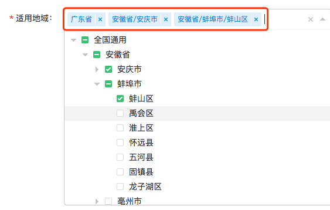

通用地区json引入方式，省市区展示方式修改，
选择的地区标签文案区域点击禁止触发删除事件
<!-- more -->
##### 做kms需求时候，切片需要跟地区关联，地区选择需求和解决方式如下：
##### 1、地区通用文件引入方式
因为省市区数据是固定的，后端同学便提出不再查库获取数据，而是将一个json文件放到了cdn上，让前端自行请求静态文件。这个时候遇到跨域的一个坑，后端只针对线上域名配置了代理，测试环境域名不固定，没法在开发和测试的时候用代理解决跨域问题。
##### 解决方案：
a、将json文件文件改成js文件，var baseCitys  = {} 改用js引入方式，然后在项目里写了一个plugin。
```javascript
在plugins文件夹里新建了一个city.js文件。
// https://cdn.dahai.com/static/global/citys.js 为数据地址
import Vue from 'vue'
import { mresolver } from '@/utils/utils'

export const plugin = {
  install() {
    if (typeof mresolver === 'function') {
      mresolver('https://cdn.dahai.com/static/global/citys.js')
    }
  }
}
Vue.use(plugin)
```
b、在nuxt.dev.config/nuxt.qa.config/nuxt.prod.config里分别配置上plugins
```javascript
plugins: [
    {
      src: '~/plugins/citys'
    }
  ]
```
c、紧接着用window.baseCitys就可以拿到地区json数据
```javascript
let datas = window.baseCitys
```

##### 2、当选择区的时候，要求显示格式为省/市/区 如图

##### 解决方案：
 可以用slot方式自定义value 值格式（slot="value-label"）给每条数据加个类似描述的字符串。拼接'省市区'
```javascript
<div class="vuetree-select-style">
    <treeselect 
        v-model="checkedRegionalArr"
        :normalizer="normalizer" //标准化源数据 
        :multiple="true" // 支持多选
        :options="regionalTreeDatas" 
        :max-height="300"
        :open-direction="openDirection"
        placeholder="请选择地域"
        no-results-text="无结果"
        value-format="object"
        :clearable="true"
        :default-expand-level="defaultExpandLevel"
        @input="selectTreeHandle"
        >
        <template scope="scope" slot-scope="{node}" slot="value-label">
          <div v-if="showDesc">
            <div>{{showDesc ? scope.node.raw.desc : scope.node.raw.name}}</div>
          </div>
        </template>
    </treeselect>
</div>

data () {
    return {
        // 多选时选中的地区
        checkedRegionalArr: [],
        // 获取地区数据
        regionalTreeDatas: [],
        normalizer(node) {
            return {
                id: node.code,
                label: node.name,
                desc: node.desc,
                children: node.children
            }
        }
    }
}
```
```javascript
// 拿到数据之后先给每一层添加desc "省/市/区" 给select默认选中的自定义格式
      addDescInfo(provinces, name, code) {
        provinces.forEach(province => {
          province.codes = code ? `${code},${province.code}` : `${province.code}`
          province.desc = name ? `${name}/${province.name}` : `${province.name}`
          if (province.children && province.children.length > 0) {
            this.addDescInfo(province.children, province.desc, province.codes)
          }
        })
        return provinces
      },
      // 地区数据
      getRegionalData () {
        // 添加全国通用在最外层
        let parentObj = {
          code: '0',
          name: '全国通用',
          desc: '全国通用',
          codes: '0'
        }
        parentObj.children = this.addDescInfo(window.baseCitys)
        this.regionalTreeDatas = [parentObj]
      }
```

##### 3、已选择的地区标签文案区域点击禁止触发删除事件
select选择值显示为标签和‘x’号两部分，vue-treeselect源码中实现的交互是点击‘x’和标签文案都会移除掉选择项。
##### 解决方案
查看源码，确定了绑定事件是mousedown。在点击文案时，需要移除关闭事件。在选择地区时调用该方法就可以。
```javascript
// 关闭选项时，去掉标签文案的关闭事件 (需求要求)
  stopLabelPropagation() {
    let sel = [...document.querySelectorAll('.vue-treeselect__multi-value-label')]
    sel.forEach(el => {
      el.removeEventListener('mousedown', function() {})
      el.addEventListener('mousedown', function(e) {
        e.stopPropagation()
      })
    })
  }
```
##### 4、编辑的时候，回显之前选择的默认值，后端返回的格式如下：
```javascript
let initRegionalArr = [
    [{code: '4', name: '福建省'}, {code: '53', name: '福州市'}],
    [{code: '1', name: '安徽省'}]
]

还是要将checkedRegionalArr 选中的数组 处理成带有desc属性的'省/市/区'格式
this.checkedRegionalArr = []
this.initRegionalArr.forEach(regionalSpan => {
  let obj = {}
  obj.code = regionalSpan[regionalSpan.length - 1].code
  obj.name = regionalSpan[regionalSpan.length - 1].name
  const nameArr = regionalSpan.map(item => item.name)
  const codesArr = regionalSpan.map(item => item.code)
  obj.desc = nameArr.join('/')
  obj.codes = codesArr.join(',')
  this.checkedRegionalArr.push(obj)
})
```